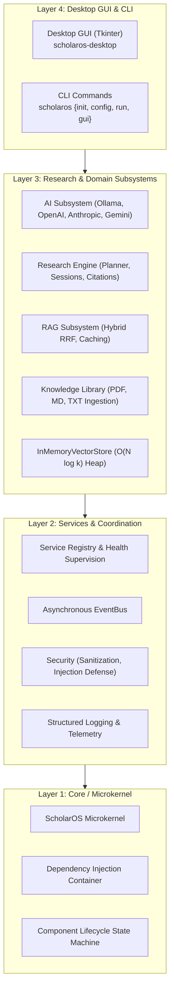

# ScholarOS

<div align="center">

[](https://python.org)
[](LICENSE)
[](tests/)
[](https://mypy.readthedocs.io/)
[](https://docs.astral.sh/ruff/)

**A modular, multi-agent AI research operating system orchestrating local language models, retrieval-augmented generation (RAG), domain tools, and scientific literature workflows.**

[Documentation](docs/index.md) • [Release Notes](RELEASE_NOTES.md) • [Installation](docs/user/installation.md) • [Architecture](docs/architecture/reference.md) • [Contributing](CONTRIBUTING.md) • [Security](SECURITY.md)

</div>

---

## 🌟 Overview

**ScholarOS** is an open-source, local-first research platform designed for scientific literature discovery, synthesis, paper analysis, and experiment management. It provides an extensible microkernel architecture connecting domain services, hybrid retrieval, local LLM inference (via Ollama), cloud models (OpenAI, Anthropic, Gemini, OpenRouter), and a modern desktop user interface.

### Key Capabilities
- **Local-First & Private**: Run models locally with Ollama (`qwen2.5:1.5b`, `llama3.2:3b`, `deepseek-r1:1.5b`). Zero sensitive research data leaves your machine unless you choose to configure cloud providers.
- **Hybrid RAG Engine**: Combines keyword matching (BM25) with dense vector search (cosine similarity) using Reciprocal Rank Fusion (RRF), backed by an $O(N \log k)$ heap vector store and sub-millisecond retrieval caching.
- **Multi-Stage Research Workflows**: Autonomous task decomposition, literature retrieval, synthesis, citation graph tracking, and report generation.
- **Universal Knowledge Library**: Ingests PDF, Markdown, Plain Text, and JSON documents with configurable sliding-window chunking.
- **Modern Desktop GUI**: Fast, responsive desktop application built with Python Tkinter, featuring non-blocking background thread workers for smooth user interaction.
- **Sandboxed Plugin Architecture**: Extensible capability-permissioned plugin system for external tools and domain adapters.

---

## 🚀 60-Second Quickstart

### 1. Install ScholarOS
```bash
# In a Python 3.12+ virtual environment:
pip install scholaros
```

### 2. Initialize Your Environment
```bash
scholaros init
```
This automatically bootstraps your platform-standard directories and generates your starter `config.toml`.

### 3. Launch the Application

#### Option A: Desktop GUI
```bash
scholaros gui
# Or use the zero-console Windows desktop launcher:
scholaros-desktop
```

#### Option B: Terminal Research Query
```bash
scholaros run "What are the latest advancements in quantum error correction?"
```

---

## 🏛️ System Architecture



For complete technical specifications, see the [Architecture Reference](docs/architecture/reference.md) and [Architecture Diagrams](docs/architecture/diagrams.md).

---

## 📖 Documentation Index

### 👤 User Guides
- [Installation & System Requirements](docs/user/installation.md)
- [First Launch & Environment Setup](docs/user/first_launch.md)
- [Configuring Local & Cloud LLMs](docs/user/llm_configuration.md)
- [Using AI Chat](docs/user/ai_chat.md)
- [Research Workflow & Synthesis](docs/user/research_workflow.md)
- [Knowledge Library & Document Ingestion](docs/user/knowledge_library.md)
- [RAG Strategies, Caching & Scoring](docs/user/rag_configuration.md)
- [Managing Plugins & Permissions](docs/user/plugins.md)
- [Troubleshooting & Diagnostics](docs/user/troubleshooting.md)

### 💻 Developer Guides
- [Developer Getting Started](docs/developer/getting_started.md)
- [Layered Architecture & IoC](docs/developer/architecture.md)
- [Module Structure & Package Map](docs/developer/module_structure.md)
- [Extension Points & Hooks](docs/developer/extension_points.md)
- [Plugin Development Guide](docs/developer/plugin_development.md)
- [AI Provider Development Guide](docs/developer/provider_development.md)
- [Testing & Quality Engineering](docs/developer/testing.md)
- [Contributing & PR Guidelines](CONTRIBUTING.md)
- [Security Policy & Vulnerability Disclosure](SECURITY.md)

---

## 🧪 Testing & Quality Standards

ScholarOS enforces strict quality engineering:
- **1,370+ Tests**: Comprehensive unit, integration, and workload benchmarks.
- **Zero Type Errors**: 100% clean `mypy scholaros scripts` across 388 source files.
- **Zero Lint Errors**: 100% clean `ruff check scholaros tests scripts`.

Run the test suite locally:
```bash
pytest -p no:langsmith -q
```

---

## 📄 License

ScholarOS is open-source software licensed under the [Apache License 2.0](LICENSE).