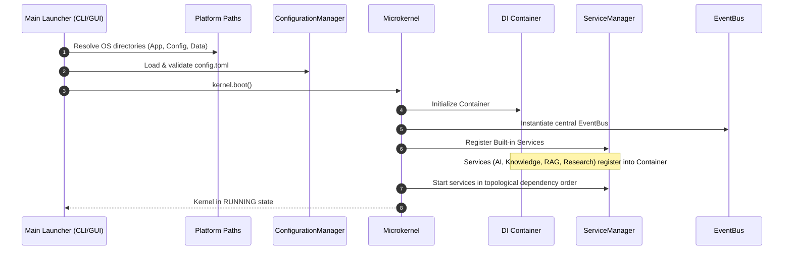
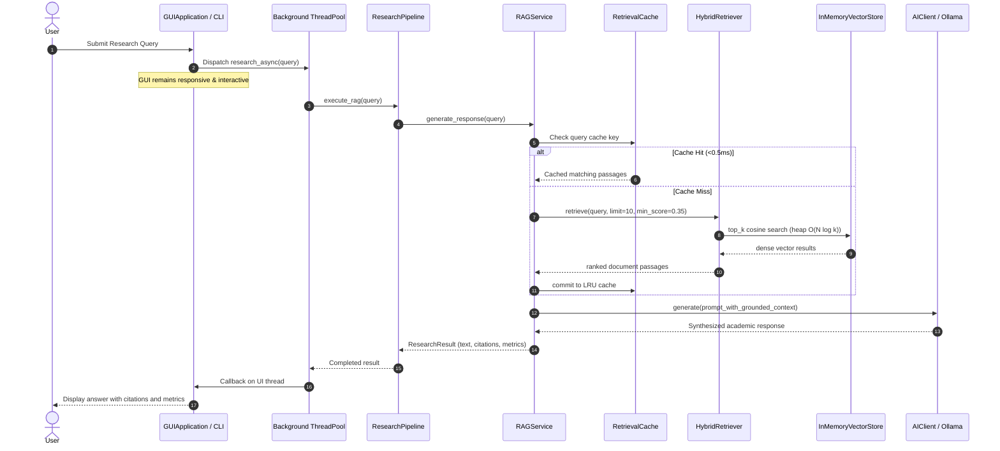
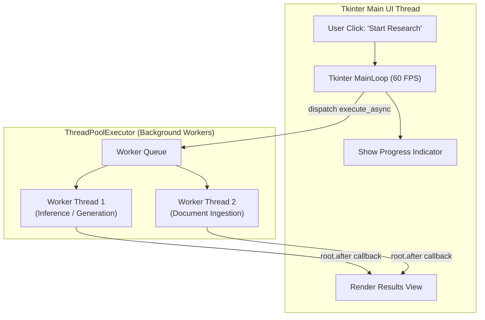
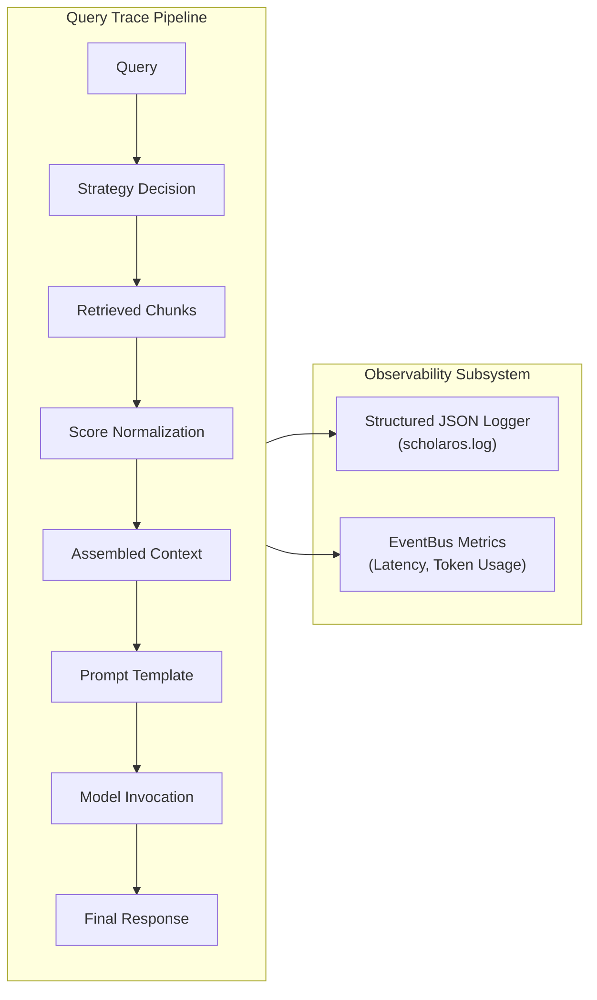

# Architectural Flowcharts & Sequence Diagrams

This document illustrates the execution lifecycles, data flows, and subsystem interactions within ScholarOS using Mermaid diagrams.

---

## 1. System Boot & DI Container Wiring Sequence

---

## 2. End-to-End RAG Research Execution Lifecycle

---

## 3. Asynchronous GUI Execution Model

---

## 4. Diagnostics & Telemetry Tracing Flow

