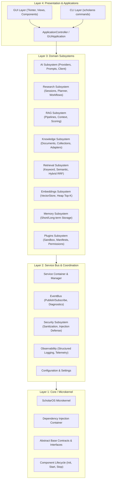

# Subsystem Architecture & Dependency Inversion

ScholarOS is engineered according to a strict **Microkernel & Inversion of Control** architecture. This document explains the dependency flow, layer boundaries, and abstraction contracts.

---

## 1. The Four-Layer Architectural Model

---

## 2. Inversion of Control (IoC) & Microkernel Rules

### The Golden Dependency Rule
> **Dependencies only point downwards.**
> A lower layer never imports or references a higher layer.

1. **Kernel / Core (Layer 1)**:
   - Does NOT know about AI providers, RAG, GUI windows, or specific tools.
   - Responsible solely for DI registration, lifecycle state machines, and base contracts.
2. **Services & EventBus (Layer 2)**:
   - Subsystems register services and publish events asynchronously.
   - Cross-subsystem communication occurs via typed events (`EventBus.publish()`) rather than tight direct coupling.
3. **Domain Subsystems (Layer 3)**:
   - Pure domain logic. No GUI code or presentation elements.
4. **Presentation & Application (Layer 4)**:
   - Orchestrates presentation without implementing low-level business logic.
   - Receives events and dispatches asynchronous tasks to worker threads.

---

## 3. Dependency Injection (DI) Container

ScholarOS utilizes a lightweight, reflection-free Dependency Injection Container (`scholaros.container.container.Container`):
- Services register instances or factory bindings (`container.add_instance()`).
- Components resolve dependencies via contract types (`container.resolve(ServiceClass)`).
- Facilitates 100% test isolation with zero monkeypatching of global state.

Next Step: Explore the physical directory and package layout in the [Module Structure Guide](module_structure.md).
