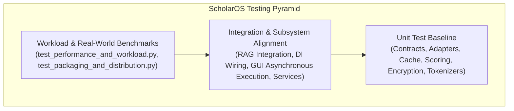

# Testing & Quality Engineering Guide

ScholarOS maintains an extraordinarily rigorous testing and quality engineering discipline. This document explains our test classifications, tooling, workload benchmarks, and regression suites.

---

## 1. Test Architecture

The repository contains over **1,340 automated tests** organized across three primary levels:



---

## 2. Running Tests

### Running the Entire Test Suite
```bash
pytest -p no:langsmith -q
```
Expected: **1,340+ passed in ~40 seconds**.

### Running Specific Test Modules
```bash
# Run Packaging & Distribution tests
pytest tests/test_packaging_and_distribution.py -v

# Run Performance & Workload benchmarks
pytest tests/test_performance_and_workload.py -v

# Run Security production tests
pytest tests/test_security_production.py -v

# Run RAG pipeline tests
pytest tests/test_rag_pipeline.py -v
```

---

## 3. Static Type Analysis with Mypy

All source code must be clean of type errors:

```bash
mypy scholaros scripts
```

Target configuration (`pyproject.toml`):
- `python_version = "3.14"`
- `ignore_missing_imports = true`
- Expected: `Success: no issues found in 380+ source files`.

---

## 4. Linting with Ruff

Code style is strictly enforced by Ruff:

```bash
ruff check scholaros tests scripts
```

Rules enforced:
- `select = ["E", "F", "W"]` (Pyflakes, pycodestyle errors and warnings)
- Line length: 100 characters max

---

## 5. Adding New Tests

When implementing new features or fixing bugs:
1. Place unit tests in `tests/test_<subsystem>.py`.
2. Follow deterministic testing patterns:
   - Use `tmp_path` for filesystem operations.
   - Use `monkeypatch` for environment variables (`SCHOLAROS_HOME`, etc.).
   - Use `MockProvider` or mock objects rather than requiring live network calls.
3. Verify that 100% of the regression suite passes before submitting a pull request.

Next Step: Review our contribution standards in the [Contributing Guide](contributing.md).
