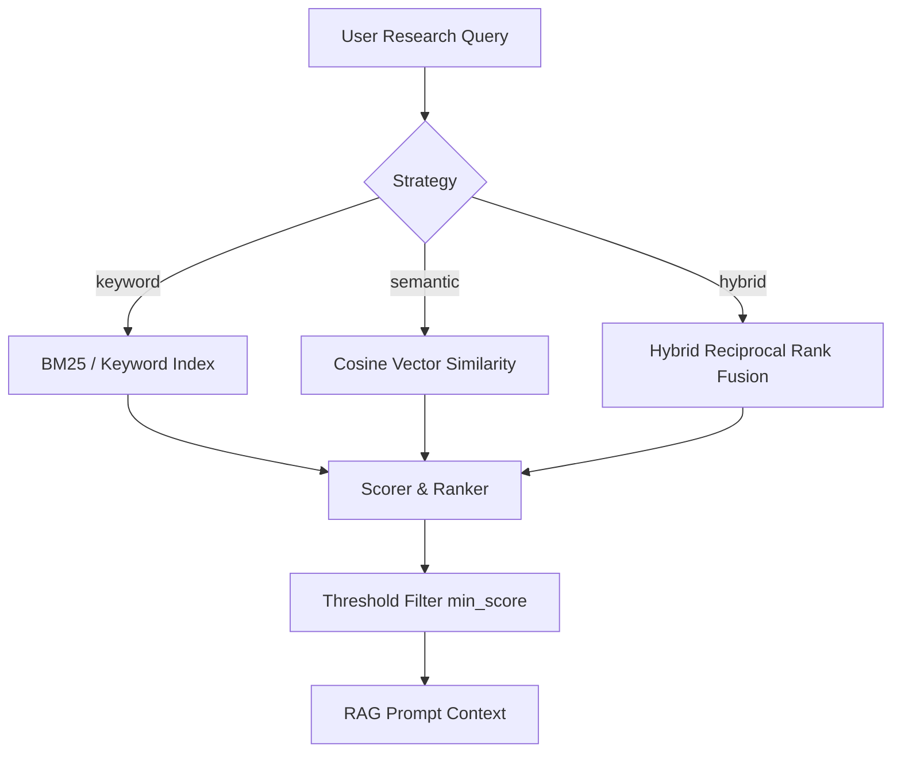

# RAG & Retrieval Configuration

Retrieval-Augmented Generation (RAG) grounds language model outputs in your local research library. This guide explains how to select retrieval strategies, tune relevance scoring, and configure retrieval caching.

---

## 1. Retrieval Strategies

ScholarOS supports three primary retrieval strategies:



### Supported Strategies
- **`hybrid` (Default & Recommended)**: Fuses keyword matching with semantic dense vector search using Reciprocal Rank Fusion (RRF). Provides the best balance between precision on specialized terminology (e.g. chemical formulas, gene names) and semantic recall on conceptual queries.
- **`semantic`**: Uses dense vector cosine similarity to retrieve documents based on semantic conceptual meaning, even if exact keywords do not match.
- **`keyword`**: Fast lexical matching based on token frequency and inverse document frequency.

---

## 2. Configuration Settings

Adjust retrieval behavior in `config.toml`:

```toml
[retrieval]
# Active strategy: "hybrid", "semantic", or "keyword"
strategy = "hybrid"

# Maximum number of document chunks to return
limit = 10

# Minimum similarity score threshold (0.0 to 1.0)
min_score = 0.35

# Enable sub-millisecond retrieval caching
cache_enabled = true

# Cache time-to-live in seconds (3600 = 1 hour)
cache_ttl = 3600

# Cache capacity (maximum entries before LRU eviction)
cache_capacity = 256
```

---

## 3. High-Performance Retrieval Caching

ScholarOS features a thread-safe LRU cache with TTL expiration:
- Identical queries against the same collection hit the cache in under **0.5 milliseconds**.
- Cache invalidation occurs automatically when documents are added or deleted from the collection.
- To disable caching during active experimentation, set `cache_enabled = false`.

Next Step: Discover how to extend ScholarOS capabilities in the [Plugins Guide](plugins.md).
